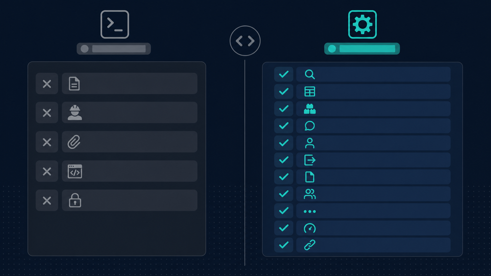

# notion-cli

A powerful command-line interface for the Notion API, built in Rust.



## Why notion-cli?

The official Notion CLI (`ntn`) focuses on pages and Workers, leaving most of the API surface accessible only through its raw `api` escape hatch. **notion-cli** exposes the full Notion API as first-class commands.

### What notion-cli does that ntn doesn't

| Feature | ntn | notion-cli |
|---------|-----|------------|
| **Search** | No command (raw API only) | `notion search <query>` |
| **Database CRUD** | No command | `notion db get/create` |
| **Data source query with filters** | Via data sources only | `notion db query <data-source-id> --filter-json '...'` |
| **Block operations** | No command | `notion block get/children/append/update/delete` |
| **Recursive block tree** | Not available | `notion block children --recursive` |
| **Comments** | No command | `notion comment list/get/create/update/delete` |
| **User listing** | Only `whoami` | `notion user me/get/list` |
| **Page property editing** | Not via `pages` | `notion page update --properties '...'` |
| **Page move** | No command | `notion page move --parent <id>` |
| **Multiple output formats** | Markdown + JSON | JSON, YAML, CSV, TSV, plain text, ID-only |
| **ID-only output for piping** | Not available | `notion search "query" --format id-only \| xargs ...` |
| **Multiple profiles** | Env var only | `notion auth switch <profile>` |
| **Secure token storage** | Keychain (OAuth only) | OS keychain for all token types |
| **Rate limit handling** | Not built-in | Automatic retry with exponential backoff + jitter |
| **Auto-pagination** | Limited | `--all` flag on every list/query command |
| **Notion URL support** | IDs only | Paste full Notion URLs as arguments |

### What ntn does that notion-cli doesn't (by design)

| Feature | Why we skip it |
|---------|---------------|
| Workers lifecycle | Notion-specific serverless platform; out of scope |
| Workers TUI | Workers-specific |
| Self-update | Package managers handle this |

## Installation

```bash
# From source
cargo install --locked --path .

# Or build directly
cargo build --release
```

## Quick Start

```bash
# Log in with your Notion API token
notion auth login

# Search your workspace
notion search "meeting notes"

# Query a data source
notion db query <data-source-id> --all --json

# Get page content
notion page content <page-id>

# List workspace users
notion user list

# Raw API access (escape hatch)
notion api GET /v1/users/me
```

## Configuration

Config is stored at `~/.config/notion-cli/config.json`. Tokens are stored securely in the OS keychain.

```bash
# Set up multiple profiles
notion auth login --profile work
notion auth login --profile personal
notion auth switch work

# Or use environment variable
export NOTION_API_TOKEN=ntn_...
```

## Output Formats

All commands support multiple output formats:

```bash
notion search "project" --json          # Full JSON
notion search "project" --format yaml   # YAML
notion db query <data-source-id> --format csv # CSV (great for spreadsheets)
notion search "project" --format id-only # Just IDs (for piping)
```

## Command Reference

| Command | Description |
|---------|-------------|
| `notion auth` | Login, logout, whoami, switch profiles |
| `notion search` | Search pages and data sources |
| `notion page` | Get, create, update, trash, restore, move pages |
| `notion db` | Get/create databases and query/list data sources |
| `notion block` | Get, list children, append, update, delete blocks |
| `notion comment` | List, get, create, update, delete comments |
| `notion user` | Get current user, list users |
| `notion file` | Upload, retrieve, and list file uploads |
| `notion api` | Raw API escape hatch |
| `notion config` | Manage CLI settings |

## License

MIT
